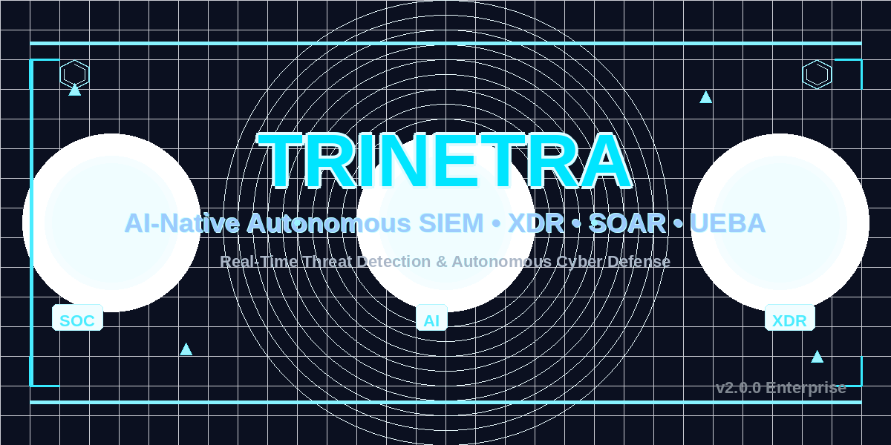

# Trinetra - AI-Powered Cyber Defense Command Center

<p align="center">
  
</p>

<p align="center">
  <a href="https://github.com/trinetra/trinetra-siem">
    
  </a>
  <a href="https://github.com/trinetra/trinetra-siem">
    
  </a>
  <a href="https://github.com/trinetra/trinetra-siem">
    
  </a>
  <a href="https://github.com/trinetra/trinetra-siem">
    
  </a>
</p>

Trinetra is an AI-powered SIEM + SOC + XDR + SOAR Lite cybersecurity platform designed for portfolio projects and demonstrations. It features real-time threat detection, MITRE ATT&CK mapping, and an embedded AI assistant powered by local LLM (Ollama).

## Features

- **Log Ingestion Engine**: REST API for Windows events, Linux auth.log, Apache/Nginx, firewall logs
- **Detection Engine**: 12 rule-based detection rules with MITRE ATT&CK mapping
- **Real-Time Dashboard**: Animated threat map, live alerts, severity charts, kill chain visualization
- **TrinetraMind AI**: 5 AI workflows - Alert Explanation, Remediation Playbook, Attack Narrative, Natural Language Threat Hunt, Incident Report Generation
- **SOAR Lite**: Automated response actions (Block IP, Disable User, Quarantine File, Isolate Endpoint)
- **Synthetic Attack Generator**: Generates realistic attack events for demos

## Tech Stack

### Backend
- Python 3.11+
- FastAPI (async)
- SQLAlchemy ORM
- SQLite (development)
- WebSockets
- Ollama (llama3.2:3b)

### Frontend
- React 18 + Vite
- Tailwind CSS
- Framer Motion
- Recharts
- react-simple-maps
- Zustand

## Quick Start

### Prerequisites
- Python 3.11+
- Node.js 18+
- Ollama (optional, for AI features)

### Installation

```bash
# Clone the repository
git clone https://github.com/royaniket4/trinetra.git
cd trinetra

# Backend setup
cd backend
pip install -r requirements.txt

# Frontend setup
cd ../frontend
npm install
```

### Running the Application (Recommended)

You can run the entire stack (Backend, Frontend, and Ollama) with a single command from the root directory:

```bash
python run_trinetra.py
```
This script automatically handles starting all services and ensures a graceful shutdown when you press `Ctrl+C`.

### Running Manually

If you prefer to start services individually:

```bash
# Terminal 1: Start Backend
cd backend
python main.py
# Server runs on http://localhost:8000

# Terminal 2: Start Frontend
cd frontend
npm run dev
# App runs on http://localhost:5173
```

### Optional: Start Ollama
```bash
# For AI features
ollama pull llama3.2:3b
ollama serve
```

## Project Structure

```
trinetra/
├── backend/
│   ├── main.py              # FastAPI entry point
│   ├── config.py            # Configuration
│   ├── database.py          # SQLAlchemy setup
│   ├── models/              # ORM models
│   ├── schemas/             # Pydantic schemas
│   ├── api/                 # Route modules
│   ├── services/            # Business logic
│   └── data/                # Static data
├── frontend/
│   ├── src/
│   │   ├── components/      # React components
│   │   ├── pages/           # Page components
│   │   ├── hooks/           # Custom hooks
│   │   └── services/        # API services
│   └── package.json
├── ai/                      # AI layer
│   ├── providers/           # LLM providers
│   └── prompts/             # Prompt templates
└── docs/                   # Documentation
```

## Demo

The dashboard displays:
- Global threat map with attack arcs
- Live alert feed with severity indicators
- MITRE ATT&CK coverage heatmap
- Kill chain visualization
- Severity distribution charts

Start the synthetic attack generator to see real-time alerts:
```bash
curl -X POST http://localhost:8000/api/simulator/toggle
```

## API Endpoints

- `POST /api/logs/ingest` - Ingest logs
- `GET /api/alerts` - Get alerts
- `GET /api/alerts/stats` - Get alert statistics
- `GET /api/incidents` - Get incidents
- `GET /api/ai/explain/{id}` - AI alert explanation
- `GET /api/ai/playbook/{id}` - AI remediation playbook
- `POST /api/soar/actions` - Execute response action
- `GET /api/reports/incidents/{id}` - Generate PDF report

## Documentation

- [Architecture](docs/ARCHITECTURE.md)
- [API Reference](docs/API.md)
- [Demo Script](docs/DEMO_SCRIPT.md)

## License

MIT License - See LICENSE for details.

---

Built with ❤️ for cybersecurity  projects
